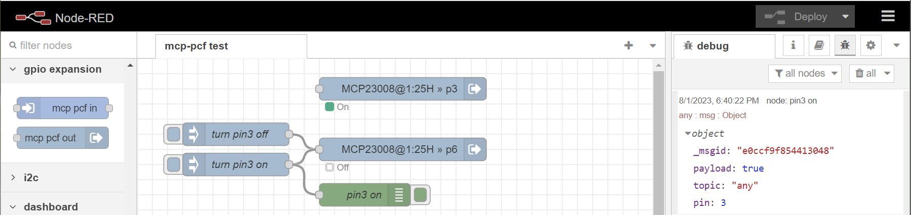
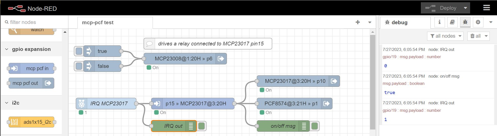

@joe-ab1do/mcp-pcf-aio
========================

<a href="http://nodered.org" target="noderedinfo">Node-RED</a> nodes to configure and control MCP23008, MCP23017, PCF8574(A) and PCF8575 i2c port expanders.

## Prerequisite to installation
This node uses the `i2cdetect` command. Normally this is included in a Linux distro. However, in cases where it is not, installation of this node will fail. Prior to installation, run `i2cdetect -l`, which should bring up a list of your i2c busses. If instead you get  `i2cdetect command not found`, then run `sudo apt install i2c-tools` and test again.  

## Install

To install use the  `Menu - Manage palette - Install`  option and search for @joe-ab1do/mcp-pcf-aio, or run the following command in your Node-RED user directory, typically `~/.node-red`

    npm i @joe-ab1do/mcp-pcf-aio
    
## Usage

Provides three nodes, one to use a pin as an input and one to use a pin as an output. The third node is a (hidden) configuration node that is used to define a physical i2c port expander chip (chip type, i2c-bus and address). Pins already in use by one of the nodes associated with a chip cannot be reselected in another node associated with the same chip.
A node will show 4 states: `On=green`, `Off=gray`, `Uninitialized=yellow`, `Error=red`.

Requires <a href="https://github.com/fivdi/i2c-bus">i2c-bus module</a>. Should get automatically installed.

**_The i2c bus is designed for (very) short lengths only_**. The maximum length of i2c bus wires is limited by a combination of bit rate, bus capacitance, pull-up resistor value and EMI. A good explanation can be found here: [An introduction to i2c over long wires](https://hackaday.com/2017/02/08/taking-the-leap-off-board-an-introduction-to-i2c-over-long-wires/). If you need to extend the bus beyond a workable length there are several options, one of which is the use of an i2c extender, e.g. the [LTC4311](https://www.adafruit.com/product/4756).

### Input: `mcp pcf in`

Defines a chip’s pin as an input port and reads its value. `mcp pcf in` needs to be associated with a configured port expander chip. Select a pre-configured chip or configure a new chip by clicking on the pencil icon. Outputs `msg.payload`=true/false, depending on the input value.

-	Read values by regularly polling them.
-	Read values when an interrupt occurs. Interrupts will occur when an input value changes from its previous value.
-	Read values using a combination of both polling and interrupts.

### Output: `mcp pcf out`

Defines a chip’s pin as an output port and sets its value. `mcp pcf out` needs to be associated with a configured port expander chip. Select a pre-configured chip or configure a new chip by clicking on the pencil icon.
Either use: 
-	A single output node to set _all_ non-input pins to 1/0 using `msg.payload`=true/false and `msg.topic`="all". Works best if all pins on a chip are output ports.
-	An output node to control one or more _different_ output pins using `msg.payload`=true/false, `msg.topic`="any" and `msg.pin`=pin# or pin# array. As an example if a `mcp pcf out` node connected to pin 1 receives a msg with `msg.payload`=true, `msg.topic`="any", `msg.pin`=7 then pin 7 will be set to 1. If `msg.pin`=[0,2,3,7], then pins 0, 2, 3 and 7 will be set to 1.
-	An output node to control the output port of the pin it is connected to using `msg.payload`=true/false (`msg.topic`is ignored if not equal to "all" or "any").

## Examples

This example shows the use of a `mcp pcf out` to set the output of another pin on the same chip. The debug node shows the message object sent to pin6 of a MCP23008 to switch the output pin3 of that same chip.

In this second, more elaborate example a `mcp pcf out` node is set to pin6 of a MCP23008 (i2c-1 @ 0x20) to drive a relay connected to pin6 (via a relay driver) that, when activated, switches pin 15 of a MCP23017 (i2c-3 @ 0X20) from 1 to 0. The change of pin15 of the MCP23017 results in an interrupt occurring (active when 0). The MCP23017's interrupt pin is connected to one of the Raspberry Pi's GPIO ports with pull-up resistor activated. The output of this GPIO-in node (node IRQ MCP23017) is wired to a `mcp pcf in` node set to pin 15 of the MCP23017. The output of this `mcp pcf in` node is wired to 2 `mcp pcf out` nodes: one set to pin10 of the same MCP23017 chip and one set to pin1 of a PCF8574 chip (i2c-3 @ 0X21). The image shows the state with the relay activated. The debug nodes show interrupt going to 0, a `msg.payload=true` being sent and interrupt reset to 1

## Resources

- [Data Sheet MCP23008](https://ww1.microchip.com/downloads/aemDocuments/documents/APID/ProductDocuments/DataSheets/MCP23008-MCP23S08-Data-Sheet-DS20001919.pdf)
- [Data Sheet MCP23017](https://ww1.microchip.com/downloads/aemDocuments/documents/APID/ProductDocuments/DataSheets/MCP23017-Data-Sheet-DS20001952.pdf)  
- [Data Sheet PCF8574(A)](https://www.ti.com/lit/ds/symlink/pcf8574.pdf?ts=1674879691726&ref_url=https%253A%252F%252Fwww.ti.com%252Fproduct%252FPCF8574)
- [Data Sheet PCF8575](https://www.ti.com/lit/ds/symlink/pcf8575.pdf?ts=1674896063788&ref_url=https%253A%252F%252Fwww.ti.com%252Fproduct%252FPCF8575)
- [Node-RED node](https://flows.nodered.org/node/@joe-ab1do/mcp-pcf-aio)  
- [Github source](https://github.com/Joe-ab1do/mcp230xx-pcf857x-aio)  
- [Forum discussion](https://discourse.nodered.org/t/new-mcp23017-pcf8574-all-in-one-node)

## Credit
I am idebted to László Szakmári who expanded Mike Wilson's original code ([MCP23017chip](https://flows.nodered.org/node/node-red-contrib-mcp23017chip)) and wrote the first few versions of mcp-pcf-aio. Thanks to our many
fruitful discussions I was able to greatly expand and streamline his code.

## Change Logs
### Change Log 2025-01-10 (YMD) Version: 3.3.2
by Joe de Groot (ab1do@optonline.net)
- BugFix: Added prerequisite to README.md that command `i2cdetect` must be available prior to installation.
### Change Log 2024-11-21 (YMD) Version: 3.3.1
by Joe de Groot (ab1do@optonline.net)
- BugFix: stopped exessive logging when polling.
### Change Log 2024-11-20 (YMD) Version: 3.3.0
by Joe de Groot (ab1do@optonline.net)
- Added option to not log changes. By default `Enable Log` is false and no log of changes to the port expander in/outputs will be logged. However the log will show that the configuration node has been successfully created.
- If a configuration node's `Enable Log` option is checked, then only changes to nodes related to that configuration node will be logged. Changes to nodes related to other configuration node will not be logged
- If all is working as desired, then `Enable Log` should be unchecked. The log is designed to be used for debugging purposes only.
- The log can be found by typing node-red-log in the terminal. Enter ^C to exit the log
### Change Log 2024-05-06 (YMD) Version: 3.2.2
by Joe de Groot (ab1do@optonline.net)
- Shortened default label of configuration node to show i2c bus and address
- Elaborated more on configuration node in ReadMe
- Added comment on i2c bus wire length (with links for more in-depth reading) to ReadMe

### Change Log 2023-10-31 (YMD) Version: 3.2.1
by Joe de Groot (ab1do@optonline.net)
- Removed obsolete input field to the right of i2c bus search button on **mcp pcf chip config** panel
- Corrected release date of version 3.2.0

### Change Log 2023-10-22 (YMD) Version: 3.2.0
by Joe de Groot (ab1do@optonline.net)
- Expanded functionality of `msg.topic`="any": `msg.pin` can now also be equal to an array of pins, e.g. `msg.pin`=[0,2,5,7]. 
Backwards compatibility is ensured by allowing `msg.pin` to equal a single number instead of requiring a 1 element array.
- Updated output node help file accordingly

### Change Log 2023-10-03 (YMD) Version: 3.1.2
by Joe de Groot (ab1do@optonline.net)
- Bugfix: when editing a chip, chip address no longer jumps to first unused address on bus, but instead remains as is until a new address is selected
- Cleaned up and streamlined code even more
- After extensive testing removed all code relating to checking if i2c read/write is in progress (was commented out)
- Added MCP23017 example flow

### Change Log 2023-09-06 (Y-M-D) Version: 3.0
by Joe de Groot (ab1do@optonline.net)
- Removed i2c address doubling mechanism to distinguish between chips: chip types are now directly selected.
- Expanded chip types to also include MCP23008 and PCF8575.
- I2C bus number can either be entered directly or available buses can be searched and selected.
- I2C addresses in use by a node cannot be reselected. Selected address also displays which of the chip's address pins should be high/low.
- I2C address selection list complies with selected chip type.
- PCF chip configuration defaults to start all high to comply with datasheet: “_The I/Os should be high before being used as inputs_”; MCP chips do not have this restriction and default to start all low.
- PCF chips output node's All High/All Low no longer affects input nodes
- PCF chips initialization when using only interrupts now does a one time read at the end of initialization to set the input nodes according to their actual input values.
- Per the latest datasheet (rev D), MCP chips cannot use pin 7 (pins 7 & 15) as inputs. This is now reflected in the input node setup. This limitation can be overridden by the user, as issues only seem to occur in very rare, exceptional cases. See the [Microchip Forum](https://forum.microchip.com/s/topic/a5C3l000000MS5oEAG/t338048) for more details on this issue.
- An input or output node can only be connected to an unused pin of the associated chip – used pins cannot be reselected.
- Interrupts for MCP chips have been changed to occur when input value changes from previous value, similar to PCF chips.
- Interrupts for MCP chips are set to open drain (ODR), active when 0 (similar to PCF chips). Connect to a GPIO port and use its internal pull-up resistor or use an external pull-up resistor.
- Added Diagnostics option to input node: if unchecked (default) only sends msg.payload reflecting the state of the chip's input port; if checked sends second message with read diagnostics;
- An output node's invert setting has now been incorporated for control of a different pin: if the output node being controlled is not present on
the configuration pane, then the invert setting of the node receiving the message determines whether the value of the pin being controlled is inverted or not; if the output node being controlled is present, then its invert setting determines whether the pin value is inverted or not.
- An output node's message structure now uses `msg.topic` to distinguish between the various chip-wide control modes and pin-control mode.
- Output node's configuration screen includes a legacy option, that when checked reverts to the previous message structure using `msg.payload`=true(false)/all1/all0/-1.
- All help screens as well as this README file have been extensively edited.
- Configuration screens now include relevant tips/notes.
- Changed various icons, including the node icons.
- If name is left blank, node label now includes chip type, i2c bus number and i2c address as well as pin it is connected to.
- `mcp pcf in` and `mcp pcf out` nodes now bundled together in the palette under the category **gpio expansion**
- Removed (commented out) code relating to checking if i2c read/write is in progress, including the creation of the related global context variable; i2c controllers already manage this process. Besides, other nodes that use the same i2c bus have no awareness of such a global context variable.

### Change Log 2022-09-08 (Y-M-D)  Version: 2.3.9.20220908
by László Szakmári (www.pizzaprogram.hu)

  - Changed Interrupt initialization of the MCP chips again: (EXPERIMENTAL! Testing needed.)  
    IOC=1 << If any of A or B input IO-bank pin changed, both INTA and INTB is triggered  
  
### Change Log 2022-09-07 (Y-M-D)  Version: 2.3.8.20220907
by László Szakmári (www.pizzaprogram.hu)

  - Changed Interrupt initialization of the MCP chips: (EXPERIMENTAL! Testing needed.)  
    MIRROR=1 << If any of A or B input IO-bank pin changed, both INTA and INTB is triggered  
    ODR=1    << Not only "Active-Low" state, but both "High/Low" input changes are triggered  
  

### Change Log 2022-06-07 (Y-M-D)  Version: 2.3.7.20220607
by László Szakmári (www.pizzaprogram.hu)

 - WARNING! Naming of commands and msg values changed !!! (No more Capital beginnings.)
  `"All0"` -> `"all0"`
  `"All1"` -> `"all1"`
  `msg.AllStatesRaw` -> `msg.allStatesRaw`
  ... also fixed name convention at source code, like `OnOFF` -> `on_off`
  Read more [here](https://discourse.nodered.org/t/new-mcp23017-pcf8574-all-in-one-node/60087/7)

 - If read-interval is set to 0 it will clear any running timer.

### Change Log 2022-06-06 (Y-M-D)  Version: 2.3.6.20220606
by László Szakmári (www.pizzaprogram.hu)

 - BUG Fix: Too long read time caused a (.warning) error instead of increasing the timer interval x2.

 - Enh.: If the last read time is shorter than interval, it resumes the timer at original interval.

### Change Log 2022-03-26 (Y-M-D)  Version: 2.3.5.20220326
by László Szakmári (www.pizzaprogram.hu)

 - PCF chips show now correct Address -at Main-Chip setup. Fixed.

 - Fixed "interval too short" auto-increase happaning if "interrupt-triggered" read occures

 + Added examples 

### Change Log 2022-03-25 (Y-M-D)  Version: 2.3.3.20220325
by László Szakmári (www.pizzaprogram.hu)

 - Changed `msg.pin` and `msg.state` to lower case.

### Change Log 2022-03-22 (Y-M-D)  Version: 2.3.2.20220322
by László Szakmári (www.pizzaprogram.hu)

- you can set 1-1 node only pro 0-7 or 8-15 and control via `msg.Pin=` and `msg.State=` if `msg.Payload=-1`  

- fixed `consol.warning` bug if Timer set = 0ms.  

### Change Log 2022-03-21 (Y-M-D)  Version: 2.3.1.20220321
by László Szakmári (www.pizzaprogram.hu)

- Fixed bug: on input change payload was always "true". 

### Change Log 2022-03-19 (Y-M-D)  Version: 2.3.0.20220319
by László Szakmári (www.pizzaprogram.hu)

- FIRST OFFICIAL RELEASE

- Enhanced html help of the node

- fixed bugs (like: partial Deploy did not clear prev. instances from context)

### Change Log 2022-03-03 (Y-M-D)  Version: 2.3.0.20220303
by László Szakmári (www.pizzaprogram.hu)

- Added PCF8574 + PCF8574A chip support. Both In + Out. 

- Fixed Naming of PFC... to PCF... (the original code was spelled wrong).

- Detailed Logging to consol can be turned on/off with `const log2consol = False;`  and `timerLog = false;`

- Fixed Input Bugs. Now stable.

- Fixed bug if same chip had both in+out pins mixed.

- Fixed crashing of Node-red if chip or I2C bus was suddenly removed from system.

- Inject (Interrupt) trigger adds extra values to msg. [] ... see help

- New Github upload. (PFC false-named one got deleted)

### Change Log 2021-01-11 (Y-M-D) 
by László Szakmári (www.pizzaprogram.hu)

- **!!! IMPORTANT CHANGE:**
 -- [ x ] Inverse is now affecting Output too ! 
 (Some relay boards are functioning "the opposite way", turning ON if pin is Low.)

- Changed Bus open/close behaviour. Separate open before/after each read/write operation block. 
  (This way no more non-stop opened bus > no more NodeRed crash if unexpected disconnect.)

- Fixed other NR crashes: Added Error handling (try - catch) for each i2c bus operation.
  Each operation has it's own value to report proper error text. _(Like: "Bus opening failed", ... etc)_
  (But execution time increased from 8ms to 12ms on Raspberri 4)

- Fixed 16pin array initialization (16x null)

- Added multiple/same pin initialization error handling. (Highlander: "There Can Be Only One" :-D )

- Added lots of comments and constants to JS file (like IOCON, IODIR_A, etc...)

- Changed icon to a chip-like one. (font-awesome/fa-ticket)

- Faster initialisation: if set to output >> skips pullup & invert writes. 

- Prevents the input-timer to run if the previous function is still running.

- +2 states of a node and color change of Off: On=green   Off=grey   Uninitialised=yellow   Error=red

- Does not starting input-timer, if there are no input nodes available. 

- Auto-increasing read-interval if < 15ms or if reading took too long.

- If error occured during read-timer >> changing interval to 5 sec >> if normal again >> changing back

- Dokument + Code changes:
-- Pretty print of JS code (inline)
-- All local variables start now with _underline
-- Many comments + constants + references added to code
-- Fixed help in mcp_pcf_chip.html file

### Change Log 2021-09-12 (Y-M-D) 
- Fixed input

- Add input trigger to handle interrupts. If msg.payload = True >> and succesfully read 
  >> msg.immediateReadSuccess = true. If any error:Result = false

- Limit debounce timeing to max = interval - 20ms

- debounce is not starting if =0

### Change Log 2021-11-11 (Y-M-D) 
- Node name changed from MCP23017chip to current ,mcp_pfc_aio v2.1.0 
 ( _AIO = All in One  IO = Input Output_ )

# MCP230xx-PCF857x-AIO
